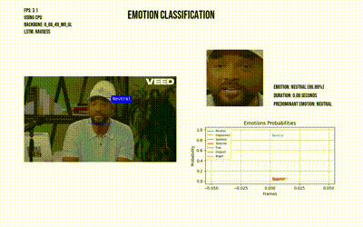

## AffectNet Emotion Classification

**Classify emotions in videos with precision using Deep Learning models.**



This project locally implements the EMO-AffectNet model, developed by @ElenaRyumina, to classify emotions from videos. The architecture combines Convolutional Neural Networks (CNNs) for feature extraction and Long Short-Term Memory (LSTM) for temporal analysis, allowing for a deeper understanding of facial expressions over time.

### Detected Emotions

The model is trained on the **AffectNet** dataset to detect the following emotions:

- **Neutral**
- **Happy**
- **Sad**
- **Surprise**
- **Fear**
- **Disgust**
- **Anger**

### Requirements

- Python 3.10
- Libraries listed in `requirements.txt`

### Model Downloads

- **Backbone Models:** [Download here](https://drive.google.com/drive/folders/1ahiKWj6gJ7yC2ye6vBEy0GJfdeguplq4)
- **LSTM Models:** [Download here](https://drive.google.com/drive/folders/1m7ATft4STye2Wiip3BZNUGIkducHC0SD)

### How It Works

1. **Feature Extraction:** CNNs process each frame of the video, extracting relevant features from facial expressions.
2. **Temporal Analysis:** The LSTM receives the sequence of features and models the temporal dependencies, capturing the evolution of emotions throughout the video.
3. **Classification:** The output of the LSTM is used to classify the predominant emotion in the video.

### How to Use

1. **Clone the Repository:**
   ```bash
   git clone https://github.com/thiagosmpa/affectnet.git
   ```

2. **Install Dependencies:**
   ```bash
   pip install -r requirements.txt
   ```

3. **Download the Models:**
   - Download the backbone and LSTM models from the links provided above.
   - Place the models in the appropriate folders within the project.

4. **Run the Main Script:**
   ```bash
   jupyter notebook inferLSTM.ipynb
   ```

### Contributions

Contributions are welcome! Feel free to open issues or pull requests.

### Notes

- Make sure you have the necessary hardware and software requirements to run the project.
- Adapt the code to your specific needs, such as changing the input video path or customizing the models used.
- Explore the code and models to deepen your understanding of emotion classification and deep learning.

**With AffectNet Emotion Classification, uncover the emotions behind facial expressions in videos!**